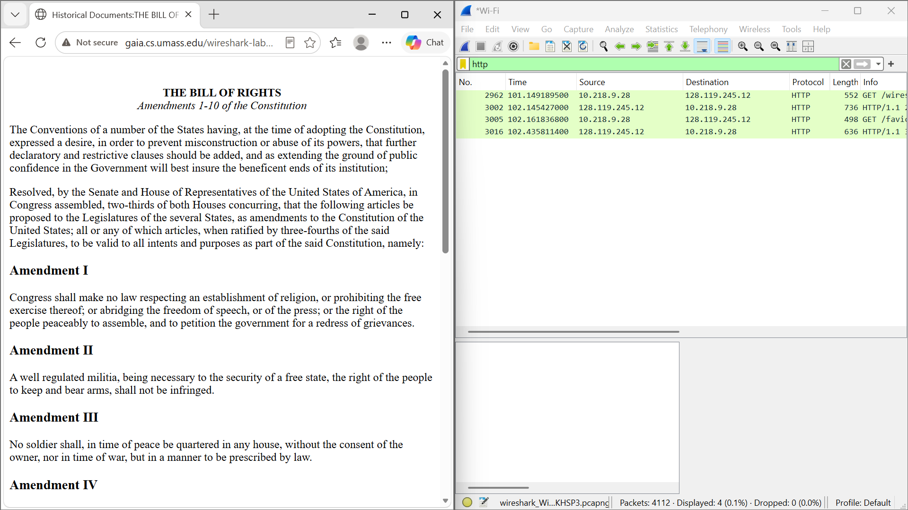
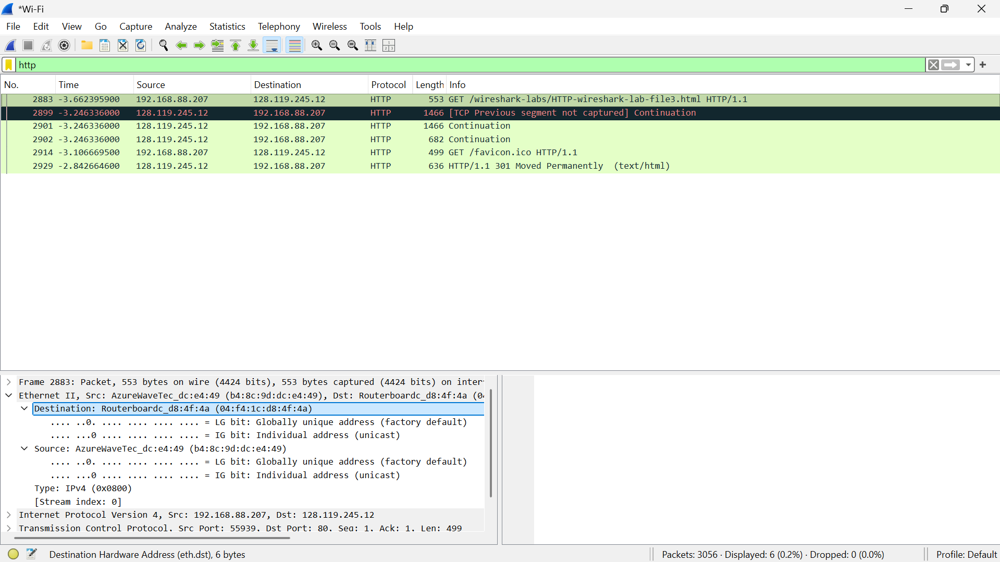
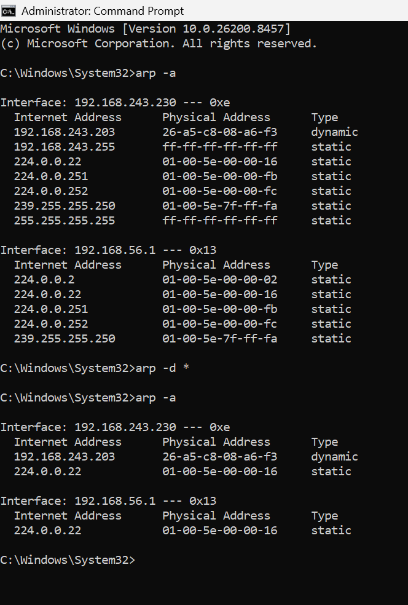
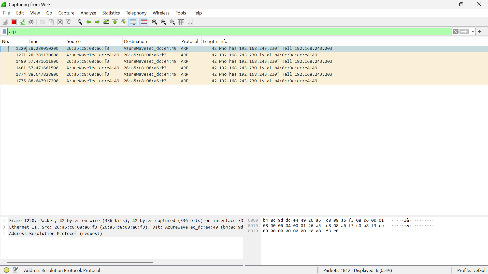
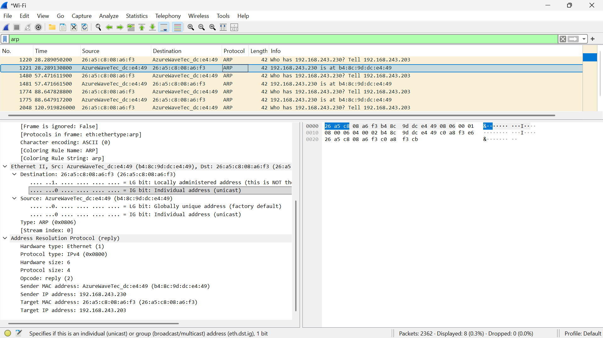

# Laporan Praktikum Jaringan Komputer

## Modul 13 - Ethernet Dan Arp

**Nama:** MUHAMMAD ZAKI OKTARUNA  
**NIM:** 103072400001 

## LANGKAH PERCOBAAN 

### Menangkap dan Menganalisis Frame Ethernet
1. Menjalankan aplikasi Wireshark
2. Start proses packet capture pada interface yang digunakan
3. Buka browser dan akses halaman http://gaia.cs.umass.edu/wireshark-labs/HTTP-wireshark-file3.html
4. Hentikan proses capture setelah halaman berhasil dimuat
5. Gunakan filter HTTP pada Wireshark
6. Memilih paket HTTP GET dan mengamati informasi Ethernet Frame yang terdapat pada paket tersebut

### Amati ARP CACHE
1. Buka Command Prompt
2. Jalankan perintah arp -a
3. Amati isi ARP Cache yang tersimpan
4. Hapus  Cahce memakai perintah arp -d *
5. Lalu kembali jalankan perintah arp -a 
6. Agar memastikan bahwa Cache telah diperbaiki

### Amati Proses ARP
1. Menjalankan kembali packet capture pada Wireshark
2. Pakai filter arp
3. Hasilkan lalu lintas jaringan dengan akses alamat lain dalam jaringan
4. Amati paket ARP Request dan ARP Reply yang muncuk
5. Analisis informasi Source MAC, Destination MAC, Source IP dan Target dari IP

