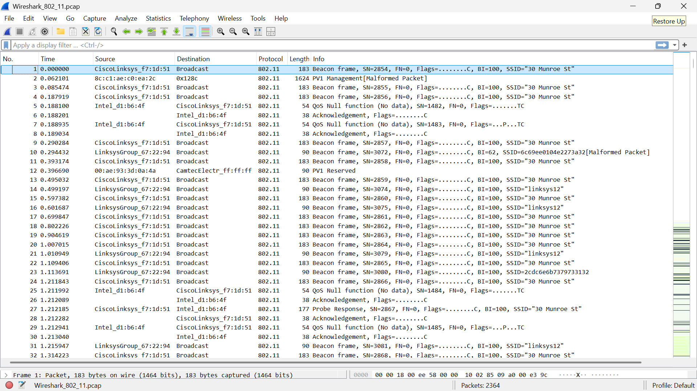
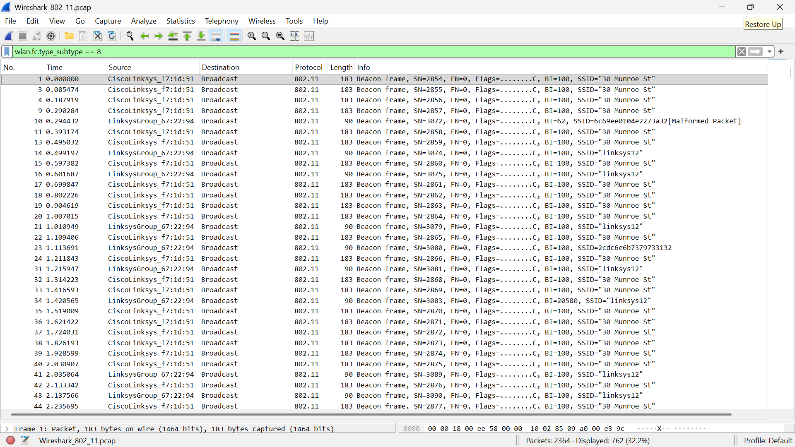
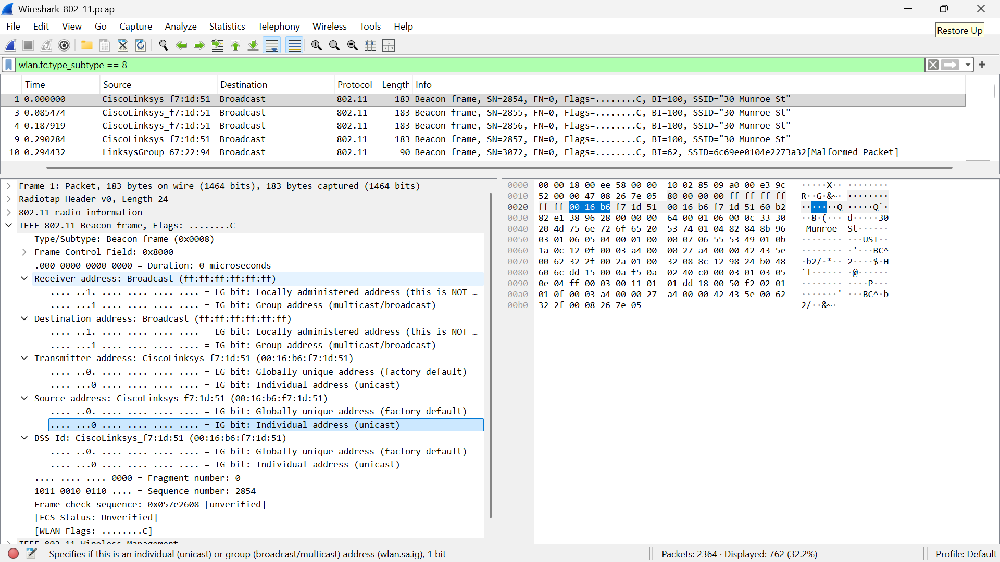
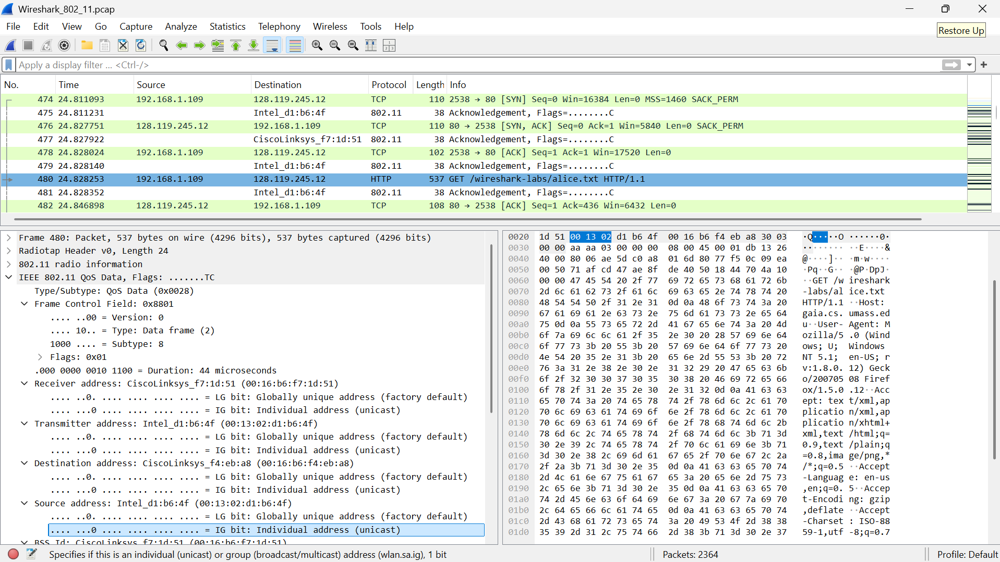
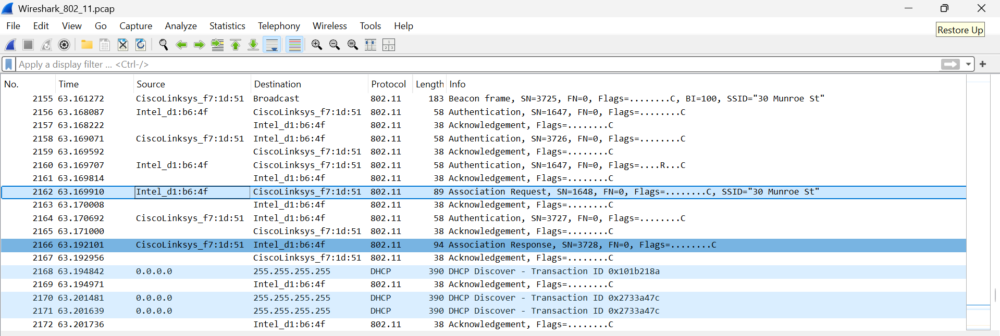
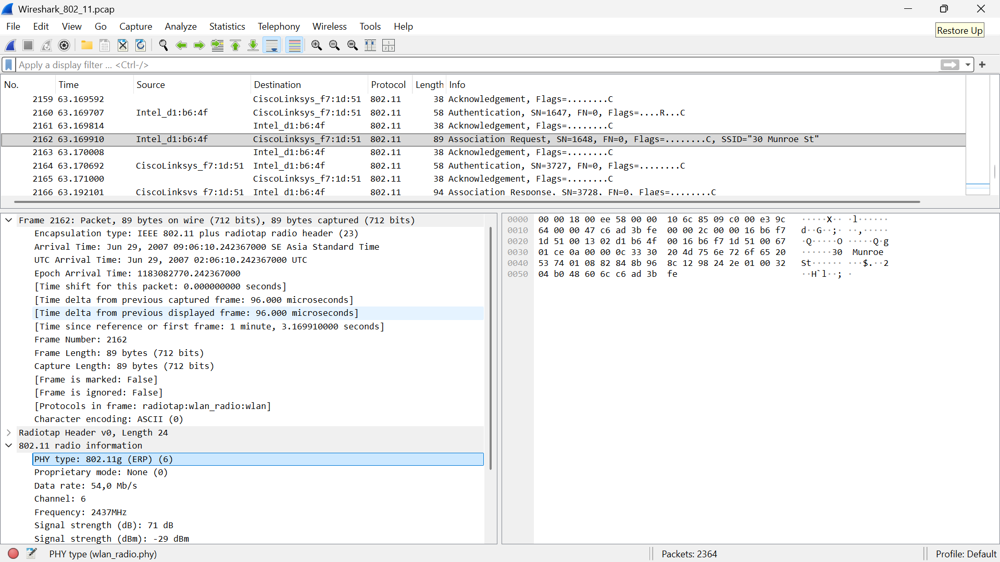
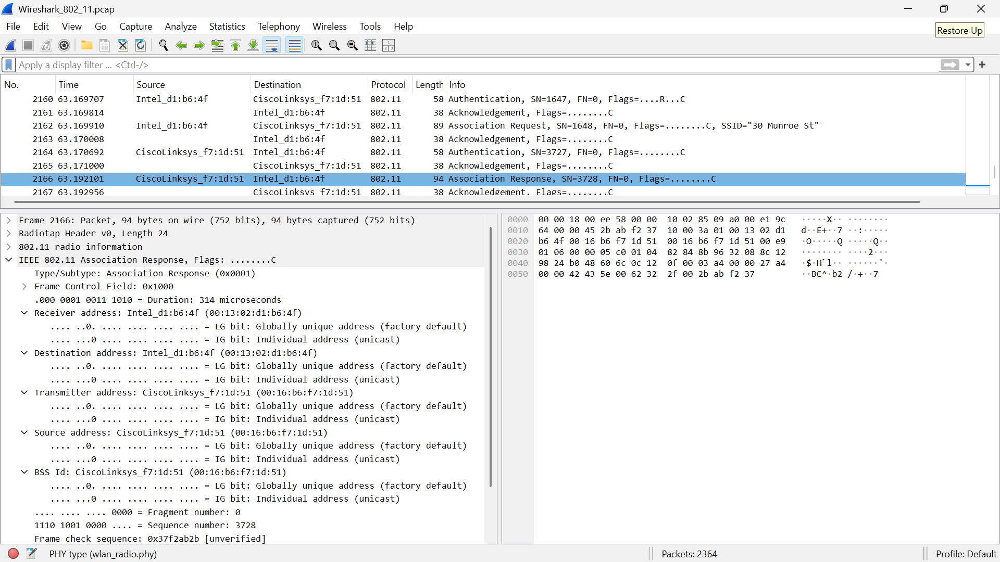

# Laporan Praktikum Jaringan Komputer

## Modul 14 - 802.11 WiFi

**Nama:** MUHAMMAD ZAKI OKTARUNA  
**NIM:** 103072400001 

## LANGKAH PERCOBAAN 
1. Mengunduh file wireshark-traces.zip
2. Mengekstrak file Wireshark_802_11.pcap
3. Membuka file trace menggunakan Wireshark
4. Mengamati Beacon Frame pada jaringan WiFi
5. Menganalisis transfer data yang terjadi melalui jaringan 802.11
6. Mengamati proses Association dan Disassociation antara host dan Access Point
7. Mendokumentasikan hasil pengamatan dalam bentuk screenshot

### Hasil Percobaan

### Kesimpulan 
Berdasarkan praktikum, dapat disimpulkan bahwa Wireshark efektif digunakan untuk menganalisis komunikasi jaringan WiFi berbasis IEEE 802.11. Proses komunikasi dimulai dari deteksi jaringan melalui *Beacon Frame* yang memancarkan informasi *Access Point*, dilanjutkan dengan proses enkoneksian melalui pertukaran *Association Request* dan *Response*. Setelah *host* resmi terhubung, transfer data dilakukan menggunakan *Data Frame* yang membawa protokol IP, TCP, dan HTTP. Melalui analisis berbagai *frame* ini, mekanisme dan alur kerja jaringan nirkabel dapat dipahami dengan lebih baik dan mendalam.