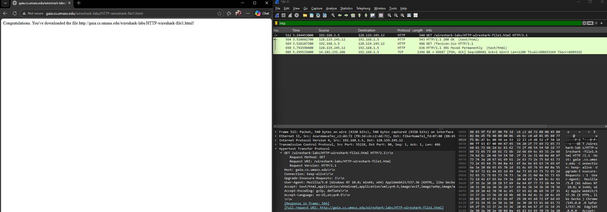
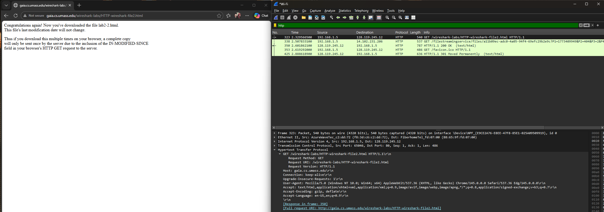
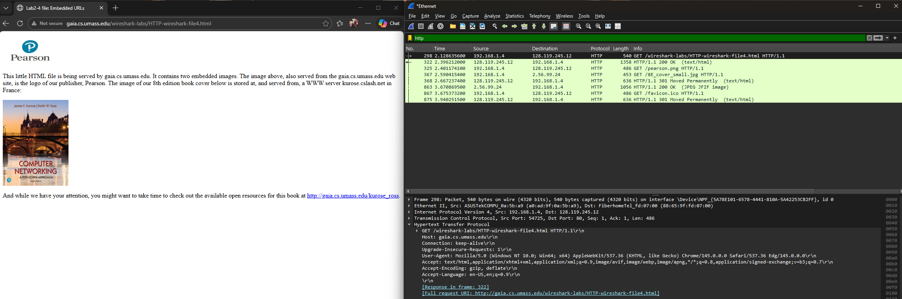
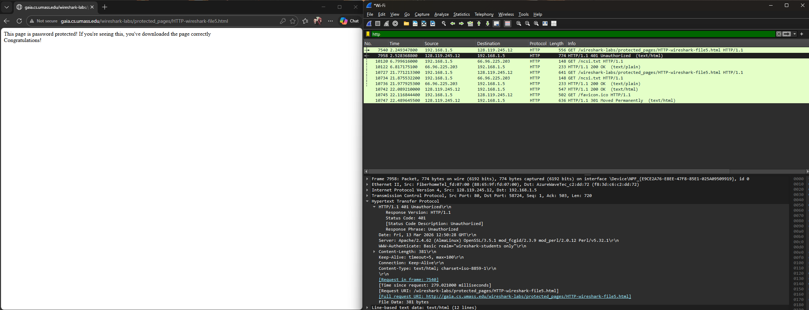

# Laporan Praktikum Jaringan Komputer

## Modul 3 – HTTP

**Nama:** MUHAMMAD ZAKI OKTARUNA  
**NIM:** 103072400001 

## Tujuan
Memahami semua cara kerja protokol HTTP dan menganalisis komunikasi antara browser dengan server menggunakan Wireshark

## Percobaan Praktikum

### 1. Basic HTTP GET / Response

#### Langkah
1. Jalankan Wireshark dan gunakan filter: `http`
2. Mulai capture paket
3. Buka browser dan akses: (http://gaia.cs.umass.edu/wireshark-labs/HTTP-wireshark-file1.html)
4. Hentikan capture setelah halaman muncul

#### Hasil
Terlihat dua pesan utama: **HTTP GET (Request)** Browser meminta file dari server. 
**HTTP Response** Server mengirimkan file HTML sebagai respon.

### 2. HTTP Conditional GET

#### Langkah
1. Setiap memulai step awal bersihkan cache browser
2. Start capture Wireshark
3. Akses: (http://gaia.cs.umass.edu/wireshark-labs/HTTP-wireshark-file2.html)
4. Refresh halaman
5. Stop capture

#### Hasil
memanfaatkan header If-Modified-Since untuk validasi berkas. Jika versi berkas di sisi server tidak mengalami perubahan sejak terakhir diakses, server hanya akan mengirimkan kode status 304 Not Modified tanpa mengirimkan isi berkas tersebut kembali. Langkah ini efektif untuk memangkas konsumsi bandwidth secara signifikan.\

# 3. Retrieving Long Documents

## Langkah
1. Start capture.
2. Buka: (http://gaia.cs.umass.edu/wireshark-labs/HTTP-wireshark-file3.html)
3. Stop capture.

## Hasil
Analisis paket menunjukkan bahwa peramban melakukan request HTTP standar untuk mendapatkan dokumen HTML. Karena ukuran file yang cukup besar melebihi kapasitas satu paket TCP, server memecah data tersebut menjadi beberapa bagian. Pada Wireshark, proses ini terlihat melalui label 'Reassembled TCP Segments', yang menandakan bahwa protokol lapisan bawah menyatukan kembali potongan-potongan tersebut agar utuh menjadi satu konten HTTP yang terbaca.

# 4. HTML dengan Embedded Objects

## Langkah
1. Start capture.
2. Akses: (http://gaia.cs.umass.edu/wireshark-labs/HTTP-wireshark-file4.html)
3. Stop capture.

## Hasil
Ketika sebuah laman diakses, peramban tidak hanya memuat kode HTML utama, tetapi secara otomatis melakukan request tambahan untuk setiap elemen pendukung yang tersemat (seperti gambar atau ikon). Hal ini terbukti dari log Wireshark yang menampilkan rentetan perintah GET terpisah untuk setiap komponen, mulai dari file HTML itu sendiri hingga file aset pendukung seperti .png atau .ico yang ada di dalam halaman tersebut.

Pada hasil capture Wireshark terlihat beberapa request HTTP:
* GET /wireshark-labs/HTTP-wireshark-file4.html
* GET /pearson.png
* GET /8E_cover_small.jpg

# 5. HTTP Authentication

## Langkah
1. Start capture.
2. Akses: (http://gaia.cs.umass.edu/wireshark-labs/protected_pages/HTTP-wireshark-file5.html)
3. Login menggunakan: username: `wireshark-students` password: `network`
4. Stop capture.

## Hasil
Untuk mengakses halaman terbatas, server awalnya menolak akses dengan kode status 401 Unauthorized sebagai tantangan autentikasi. Setelah itu, peramban akan melakukan pengiriman ulang request dengan menyertakan header Authorization. Informasi kredensial di dalamnya hanya disamarkan menggunakan skema Base64 (bukan enkripsi), sehingga sangat rentan dibaca oleh pihak ketiga jika tidak dilindungi oleh protokol enkripsi seperti HTTPS.

# Kesimpulan
* Pola Komunikasi: HTTP berfungsi sebagai protokol utama antara browser (klien) dan web server dalam pertukaran data.
* Efisiensi Caching: Melalui Conditional GET dan header If-Modified-Since, browser dapat memvalidasi cache untuk menghindari pengunduhan ulang konten yang tidak berubah.
* Fragmentasi Data: Berkas berukuran besar dipecah menjadi beberapa segmen TCP saat transmisi dan akan disatukan kembali oleh browser agar menjadi dokumen utuh.
* Pemuatan Aset: Setiap elemen pada halaman (seperti gambar atau ikon) memerlukan permintaan HTTP yang terpisah untuk bisa dimuat secara lengkap.
* Risiko Autentikasi: Mekanisme Basic Authentication hanya menggunakan encoding Base64 yang tidak memberikan enkripsi asli, sehingga data kredensial sangat rentan jika dikirim tanpa proteksi HTTPS

