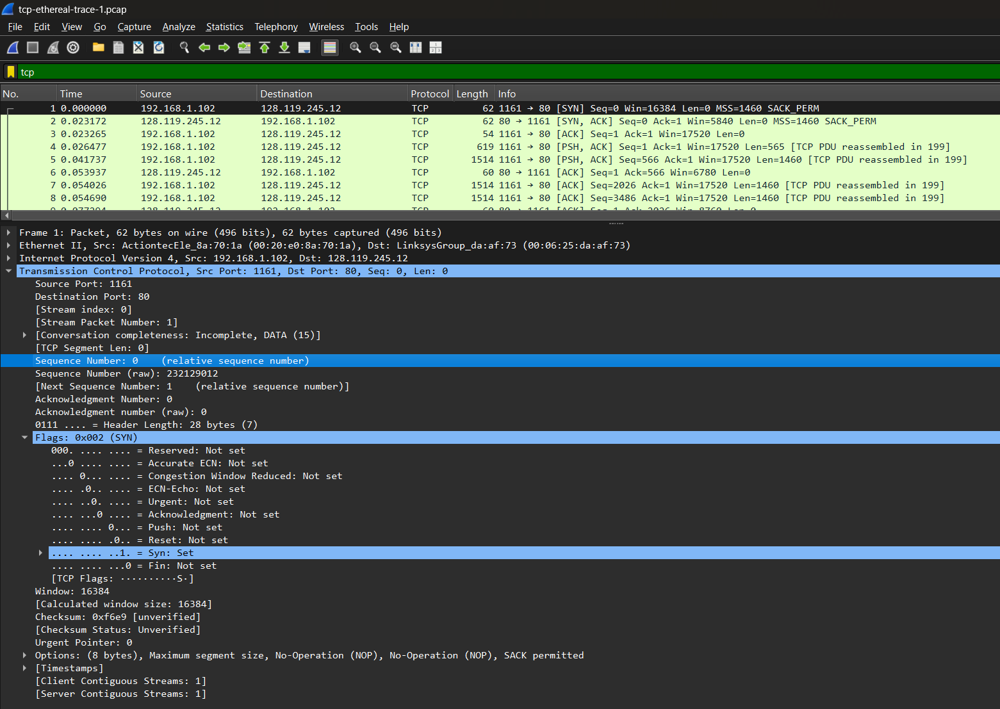
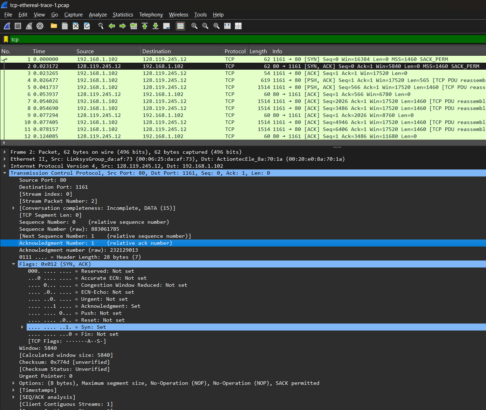
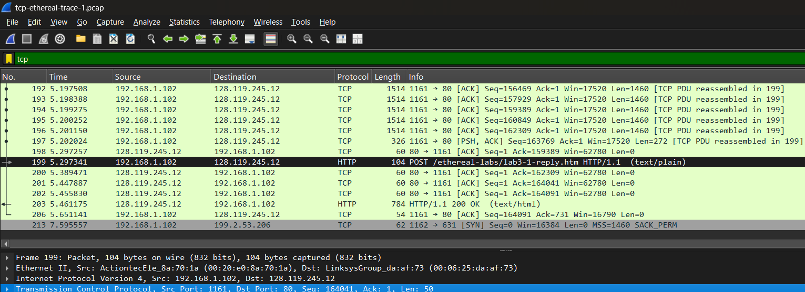
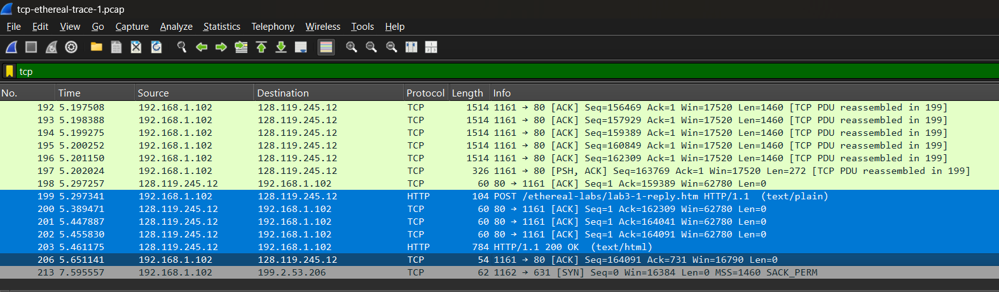
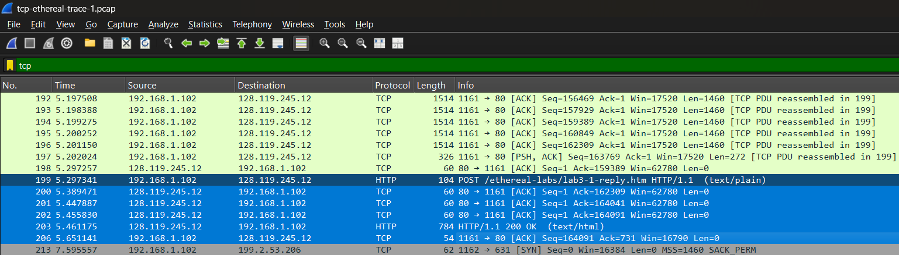
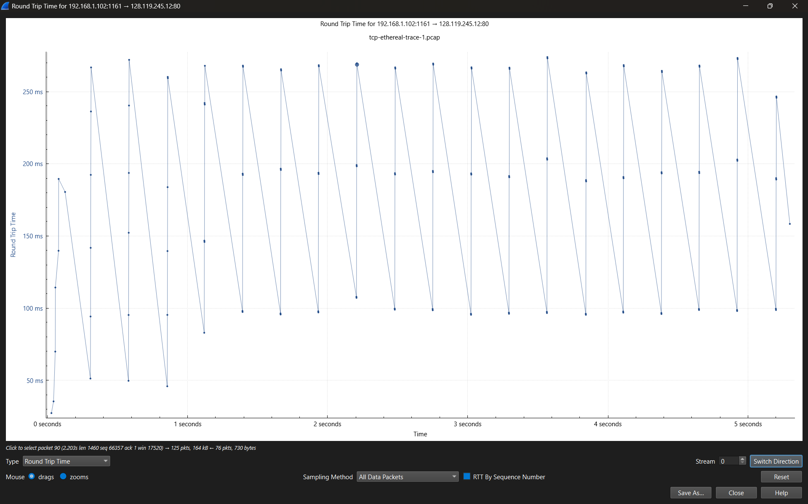

# Laporan Praktikum Jaringan Komputer

## Modul 6 – TCP

**Nama:** MUHAMMAD ZAKI OKTARUNA  
**NIM:** 103072400001 

## Tujuan
memahami atau mengetahui cara kerja protokol TCP menggunakan Wireshark

## Percobaan Praktikum

### 6.2 

#### Langkah - Langkah
1. Siapkan Wireshark lalu salin link yang ada di modul 6 bagian 6.2 
2. Jika sudah mulai capture di Wireshark dan buka link di website
3. Lalu salin semua text yang ada di sana ke notepad dan di simpan. Lalu selanjutnya buka link http://gaia.cs.umass.edu/wireshark-labs/TCP-wireshark-file1.html di website tanpa menghentikan capture Wireshark
4. Sesudah masuk websitenya akan ada sebuah perintah untuk memasukkan file yang sudah di simpan sebelumnya, dan dibawah perintah itu ada perintah kedua untuk melanjutkan setelah memasukkan file sebelumnya 

5.  Setelah melanjutkan dari step sebelumnya akan muncul gambar seperti dibawah ini 

6. Setelah berhasil akan memunculkan seperti gambar di bawah untuk bagian Wiresharknya

### 6.3

#### Langkah - Langkah 
1. Pastikan mendownload Wireshark traces zip yang sudah disediakan di modul 6
2. Buka Traces zip yang sudah di download lalu ikuti petunjuk di modulnya
3. Pertama filter tcp dulu di bagian filter kanan atas, temukan tree way handshake di paling atas
 

#### Jawab Pertanyaan
1. Alamat IP dan Nomor Port TCP Komputer Klien (Sumber) Komputer klien adalah perangkat yang memulai koneksi (mengirimkan segmen SYN).

Alamat IP Klien: 192.168.1.102
Nomor Port TCP Klien: 1161

Analisis: Dilihat dari paket nomor 1, baris "Info" menunjukkan 1161 -> 80 SYN. Berarti port sumber (source port) yang dibuka oleh komputer klien 1161. Alamat IP sumber juga terlihat jelas di kolom "Source"
2. Alamat IP dan Nomor Port TCP gaia.cs.umass.edu
Server gaia.cs.umass.edu adalah tujuan dari transfer file tersebut.

Alamat IP Server: 128.119.245.12
Nomor Port TCP Server: 80

Analisis:
* Alamat IP: Terlihat pada kolom "Destination" di paket nomor 1 (atau kolom "Source" pada paket balasan nomor 2).
* Nomor Port: Port 80 adalah port standar untuk layanan HTTP. Server menerima permintaan pada port 80 dan mengirimkan balasan (segmen SYN, ACK pada paket nomor 2) juga menggunakan port 80 sebagai sumbernya

### 6.4

#### Jawab Pertanyaan
1. Segmen TCP pertama (nomor paket 1) memiliki relative sequence number 0. Segmen ini diidentifikasi sebagai segmen SYN karena bagian TCP Flags terdapat tanda 'Syn: Set' (nilai flag 0x002). Penggunaan flag SYN ini langkah pertama dari TCP Three-Way Handshake untuk meminta sinkronisasi koneksi dengan server gaia.cs.umass.edu

2. Pada segmen SYNACK (paket 2), server menggunakan relative sequence number 0 dan memberikan relative acknowledgement number 1. Nilai acknowledgment ini diperoleh dari nilai sequence number klien sebelumnya (0) ditambah 1. Segmen ini disebut sebagai SYNACK karena mengaktifkan kedua flag sekaligus (SYN dan ACK), yang merupakan tahap kedua dalam TCP Three-Way Handshake

3. Berdasarkan analisis trace pada paket nomor 199, segmen TCP yang membawa perintah HTTP POST memiliki relative sequence number sebesar 164041. Diverifikasi dengan memeriksa field data pada packet details, di mana kata kunci 'POST' ditemukan sebagai bagian dari payload TCP

4. Semua jawaban lengkap tertera dibawah ini 

5. Beragam untuk length semua ke 6 segmen tcp pertama yaitu : 62, 62, 54, 619, 1514, 60

6. Tertera win itu buffer, setelah dilihat dan ditelusuri lebih lanjut tidak ada karena tidak ada yang 0 atau terhambat

7. Tidak ada tcp retransmisi

8. Sesuai perjanjian dikelas no 8 dan 9 tidak dikerjakan

### 6.5 

#### Jawab Pertanyaan
1.Slow start itu dia itu ngirim ada lonjakan tertentu setiap waktu dibagian bawah, congestion avoidant dibagian paling atas. Bayangkan koneksi TCP seperti seorang pengemudi yang sedang mencari kecepatan paling pas di jalan raya. Pada fase Slow Start, pengemudi langsung "tancap gas" dengan meningkatkan kecepatan pengiriman data secara cepat untuk melihat kapasitas maksimal jalan. Merasa jalanan mulai padat atau mencapai batas tertentu (ssthresh), TCP berpindah ke fase Congestion Avoidance, di mana pengemudi mulai lebih berhati-hati dengan menambah kecepatan secara pelan dan stabil agar tidak terjadi kemacetan. Pola grafik "gergaji" yang    dilihat adalah mekanisme pertahanan TCP: saat pengemudi mendeteksi kemacetan (RTT naik tajam karena antrean penuh), ia akan langsung "ngerem mendadak" atau mengurangi kecepatan secara drastis untuk menghindari tabrakan (packet loss), sebelum akhirnya perlahan mencoba menambah kecepatan kembali

2. No dua tidak dikerjakan sesuai perjanjian
